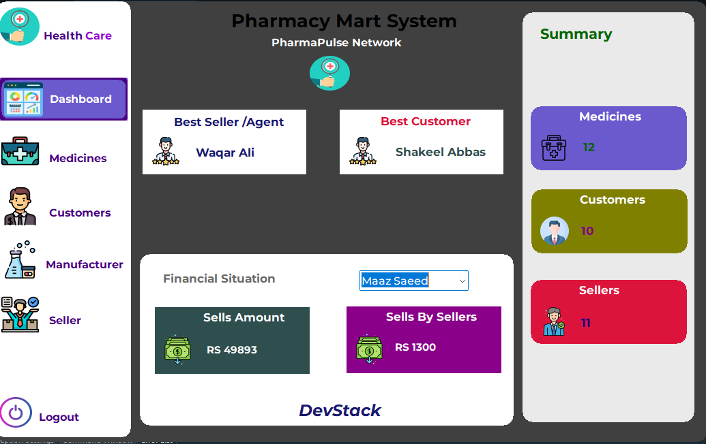
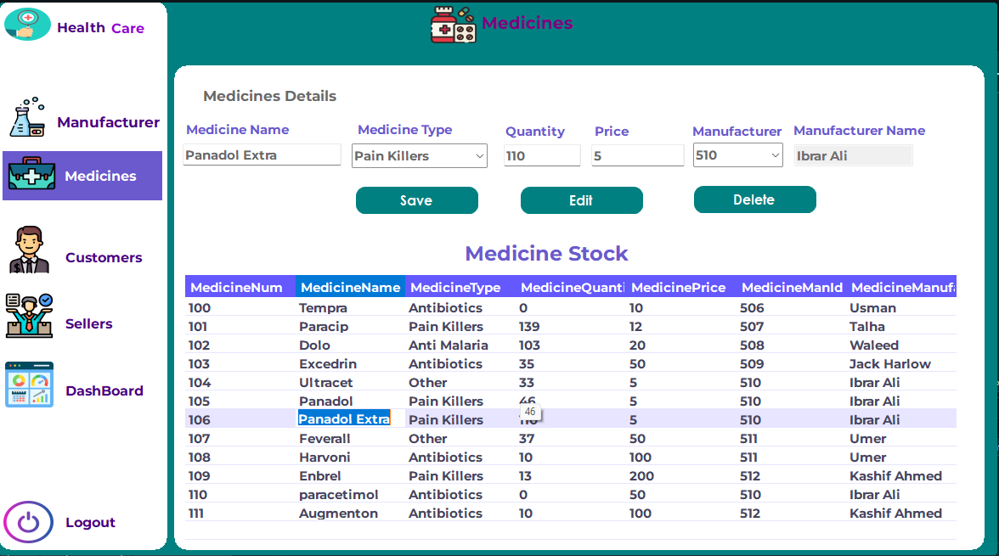
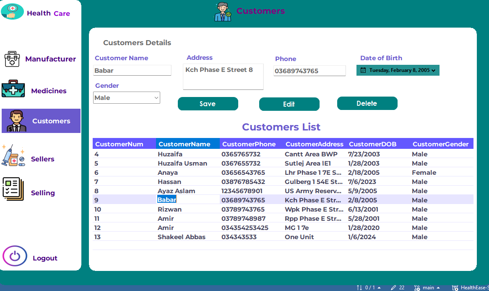
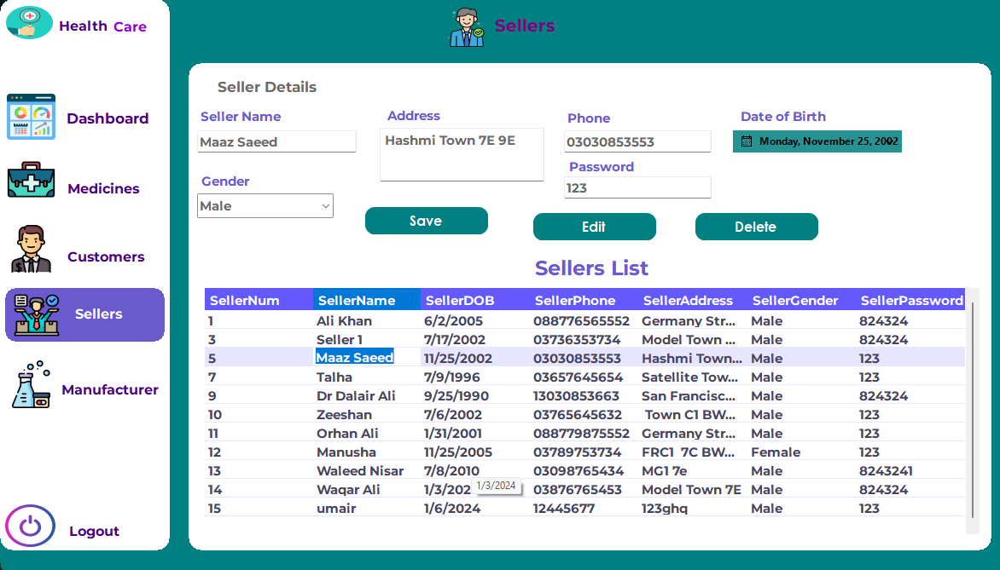

                                                                     ## Health Ease System

This is a Health Ease System developed using C# and Windows Forms for the frontend interface. It uses SQL Server for the backend database.

## Design Interface 

1. 
2. 
3. 
4. 
5. 

## Features

- **Medicine Management**: Allows users to add, update, and delete medicines with details such as name, type, quantity, price, and manufacturer.
- **Customer Management**: Enables managing customer records including name, address, phone, DOB, and gender.
- **Dashboard**: Provides an overview of the system, including the count of medicines, customers, sellers, total sales, and highlights best sellers and customers.
- **Navigation**: Simple and intuitive navigation across different sections of the system.

## Technologies Used

- C#
- Windows Forms
- SQL Server (LocalDB)

## Setup Instructions

1. Clone the repository:

2. Database Setup:
- Ensure SQL Server is installed.
- Attach the provided `PharmacySystemDB.mdf` file to your SQL Server instance.
- Update the connection string in the code to match your SQL Server instance.

3. Open the project in Visual Studio:
- Ensure you have Visual Studio installed to run and modify the project.

## Usage

- Open the project in Visual Studio.
- Build and run the solution.
- Navigate through different sections:
- **Medicines**: Manage medicines, their types, quantities, prices, and manufacturers.
- **Customers**: Add, update, or delete customer records.
- **Dashboard**: Get an overview of system statistics and sales details.

## Contributors

- Add your name here if you contributed to the project.

- ## Developer
- Syed Maaz Saeed

